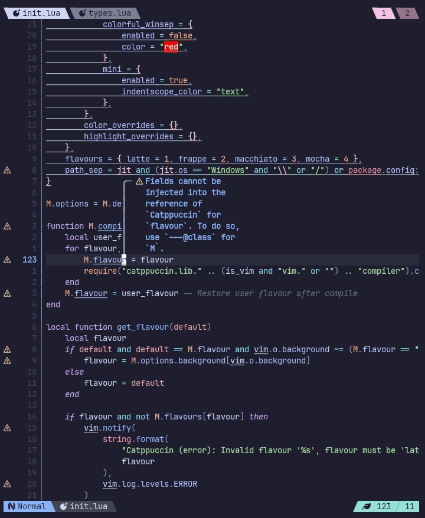

Hey there!👋

My name is `OXY2DEV`(no, that's not my real name). I am a student who likes programming & *terminals*.

I make `Neovim` plugins in my free time and sometimes make basic websites.

For my editor I use `Neovim` and I do everything inside `Termux`.

I have experience in `Lua`, `C`, `Javascript` & `Sass`. I also some experience in `Bash`. I also made simple `CLI` apps using `NodeJs`(not the brightest decision, I know).

I also love ricing and tinkering!

Also consider checking out my [website](https://oxy2dev.netlify.app/), though it is quite *basic*.

<!--
    vim:nospell:
-->
